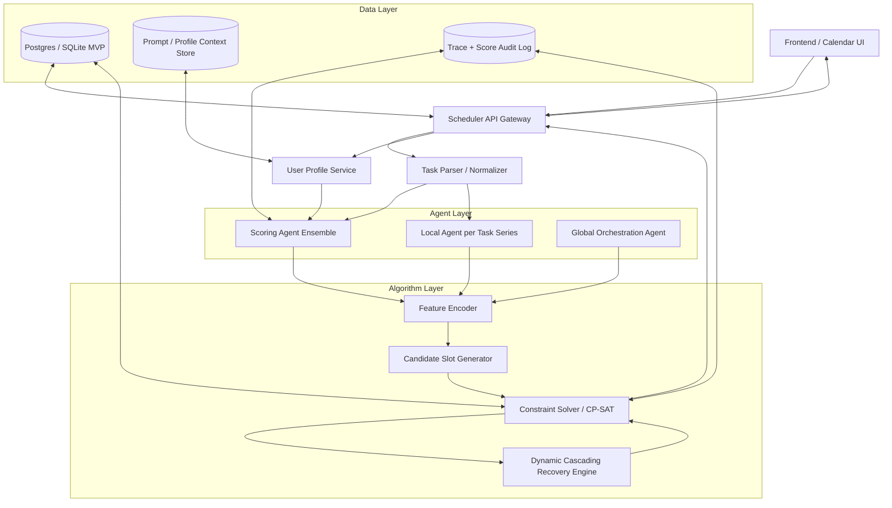

# 认知能耗自适应调度引擎技术蓝图

## Phase 1: 系统架构设计与 3 人分工协议



### 3 人模块切分

| 开发者 | 职责边界 | 交付物 |
|---|---|---|
| A：算法与数据流 | 调度模型、约束求解、级联重排、数据 schema | `scheduler_core`, `constraint_solver`, `recovery_engine`, DB schema |
| B：Agent 与评估器 | Scoring Agent、Local Agent、Prompt、评分聚合、置信度校准 | `agent_gateway`, prompt templates, ensemble scorer |
| C：前端与接口编排 | 任务创建、日历视图、用户画像问卷、调度结果解释 | Web UI, API client, timeline renderer |

核心协议：三人只通过 `Task_Object`, `Score_Matrix`, `User_Profile`, `Schedule_Result` 通信，不共享内部实现。

### `Task_Object`

```json
{
  "$id": "Task_Object",
  "type": "object",
  "required": ["task_id", "title", "duration_min", "deadline", "status"],
  "properties": {
    "task_id": { "type": "string" },
    "series_id": { "type": ["string", "null"] },
    "title": { "type": "string" },
    "description": { "type": "string" },
    "duration_min": { "type": "integer", "minimum": 5 },
    "deadline": { "type": "string", "format": "date-time" },
    "earliest_start": { "type": ["string", "null"], "format": "date-time" },
    "hard_constraints": {
      "type": "object",
      "properties": {
        "fixed_time_window": { "type": ["array", "null"] },
        "required_environment": { "type": "array", "items": { "type": "string" } },
        "must_be_contiguous": { "type": "boolean" },
        "precedence_task_ids": { "type": "array", "items": { "type": "string" } }
      }
    },
    "soft_constraints": {
      "type": "object",
      "properties": {
        "preferred_time_windows": { "type": "array" },
        "avoid_time_windows": { "type": "array" },
        "max_split_count": { "type": "integer" }
      }
    },
    "status": { "enum": ["pending", "scheduled", "missed", "done", "cancelled"] }
  }
}
```

### `Score_Matrix`

```json
{
  "$id": "Score_Matrix",
  "type": "object",
  "required": ["task_id", "scores", "confidence", "agent_votes"],
  "properties": {
    "task_id": { "type": "string" },
    "scores": {
      "type": "object",
      "required": ["urgency", "complexity", "cognitive_load", "block_integrity", "environment_dependency"],
      "properties": {
        "urgency": { "type": "number", "minimum": 0, "maximum": 1 },
        "complexity": { "type": "number", "minimum": 0, "maximum": 1 },
        "cognitive_load": { "type": "number", "minimum": 0, "maximum": 1 },
        "block_integrity": { "type": "number", "minimum": 0, "maximum": 1 },
        "environment_dependency": { "type": "number", "minimum": 0, "maximum": 1 }
      }
    },
    "confidence": { "type": "number", "minimum": 0, "maximum": 1 },
    "agent_votes": {
      "type": "array",
      "items": {
        "type": "object",
        "properties": {
          "agent_id": { "type": "string" },
          "scores": { "type": "object" },
          "rationale": { "type": "string" }
        }
      }
    }
  }
}
```

### `User_Profile`

```json
{
  "$id": "User_Profile",
  "type": "object",
  "required": ["user_id", "chronotype", "energy_curve", "weights"],
  "properties": {
    "user_id": { "type": "string" },
    "chronotype": { "enum": ["morning", "afternoon", "night", "irregular"] },
    "energy_curve": {
      "type": "array",
      "items": {
        "type": "object",
        "properties": {
          "time_range": { "type": "array", "items": { "type": "string" } },
          "energy": { "type": "number", "minimum": 0, "maximum": 1 }
        }
      }
    },
    "weights": {
      "type": "object",
      "properties": {
        "lateness": { "type": "number" },
        "cognitive_fit": { "type": "number" },
        "context_switch": { "type": "number" },
        "fragmentation": { "type": "number" },
        "preference_match": { "type": "number" }
      }
    },
    "available_windows": { "type": "array" },
    "environment_slots": { "type": "array" },
    "max_daily_deep_work_min": { "type": "integer" }
  }
}
```

## Phase 2: 核心调度算法建模

设任务集合为 `T`，候选时间片集合为 `K_i`。

决策变量：

```math
x_{i,k} \in \{0,1\}
```

表示任务 `i` 是否被放入候选时间片 `k`。

Agent 评分映射：

```math
p_i = \alpha_u u_i + \alpha_c c_i + \alpha_l l_i + \alpha_b b_i + \alpha_e e_i
```

其中：

- `u_i`: urgency
- `c_i`: complexity
- `l_i`: cognitive_load
- `b_i`: block_integrity
- `e_i`: environment_dependency

目标函数：

```math
\min \sum_i w_1 L_i
+ \sum_i \sum_k x_{i,k} w_2 |load_i - energy_k|
+ \sum_{i,j} w_3 switch_{i,j}
+ \sum_i w_4 frag_i
- \sum_i \sum_k x_{i,k} w_5 p_i fit_{i,k}
```

核心约束：

```math
\sum_{k \in K_i} x_{i,k} = 1
```

每个任务必须被安排一次。

```math
x_{i,k} + x_{j,k'} \le 1
```

任意重叠时间片不能同时占用。

```math
end_i \le deadline_i + L_i
```

允许软延迟，但延迟进入惩罚项。

```math
end_i \le start_j,\quad \forall i \in precedence(j)
```

满足任务依赖拓扑。

```math
env(k) \supseteq required\_env(i)
```

环境硬约束必须满足。

```math
split_i \le max\_split_i
```

切分次数受控；若 `must_be_contiguous = true`，则 `split_i = 1`。

动态级联重排触发条件：

```text
event in ["task_missed", "deadline_changed", "duration_changed", "profile_changed"]
```

重排范围：

```text
affected_tasks = downstream(missed_task)
               ∪ same_series_tasks
               ∪ tasks_overlapping_recovery_window
```

Python 核心逻辑：

```python
def schedule(tasks, score_matrix, user_profile, calendar):
    features = encode_features(tasks, score_matrix, user_profile)

    candidates = {}
    for task in tasks:
        candidates[task.id] = generate_feasible_slots(
            task=task,
            calendar=calendar,
            energy_curve=user_profile.energy_curve,
            environment_slots=user_profile.environment_slots
        )

    model = CpSatModel()

    x = {}
    for task in tasks:
        for slot in candidates[task.id]:
            x[task.id, slot.id] = model.new_bool_var(f"x_{task.id}_{slot.id}")

    for task in tasks:
        model.add(sum(x[task.id, s.id] for s in candidates[task.id]) == 1)

    for a, b in overlapping_candidate_pairs(candidates):
        model.add(x[a.task_id, a.slot_id] + x[b.task_id, b.slot_id] <= 1)

    for task in tasks:
        for parent_id in task.precedence_task_ids:
            model.add(end_var(parent_id) <= start_var(task.id))

    objective_terms = []

    for task in tasks:
        scores = score_matrix[task.id].scores
        priority = weighted_priority(scores, user_profile.weights)

        for slot in candidates[task.id]:
            lateness = max(0, slot.end - task.deadline)
            cognitive_gap = abs(scores["cognitive_load"] - slot.energy)
            fragmentation = slot.fragmentation_penalty
            preference = slot.preference_fit

            cost = (
                user_profile.weights["lateness"] * lateness
                + user_profile.weights["cognitive_fit"] * cognitive_gap
                + user_profile.weights["fragmentation"] * fragmentation
                - priority * preference
            )

            objective_terms.append(cost * x[task.id, slot.id])

    model.minimize(sum(objective_terms))
    solution = model.solve(time_limit_sec=3)

    return materialize_schedule(solution, x, candidates)
```

MVP 建议：用 OR-Tools CP-SAT；时间粒度固定为 `15min`；先支持单用户、单日/三日滚动窗口。

## Phase 3: Agent 交互流水线

生命周期：

```text
1. 用户创建任务
2. Task Parser 标准化 duration / deadline / constraints / series_id
3. Scoring Agent Ensemble 对任务打分
4. Score Aggregator 计算均值、方差、置信度
5. Local Agent 对同 series_id 任务生成局部偏序与资源建议
6. Global Agent 汇总 profile + scores + local plans
7. Solver 生成全局排期
8. Explanation Agent 生成可解释调度原因
9. 用户完成 / 错过 / 修改任务
10. Dynamic Cascading Recovery 触发局部重排
```

Agent 触发时机：

| Agent | Trigger | Output |
|---|---|---|
| Scoring Agent | 任务创建、任务修改、画像更新 | `Score_Matrix` |
| Local Agent | 同一 `series_id` 任务数 >= 2 | 局部优先级、依赖、建议时间块 |
| Global Agent | 调度请求、重排请求 | 全局调度策略参数 |
| Recovery Agent | missed / delayed / interrupted | affected task set |
| Explanation Agent | 排期完成后 | 用户可读解释 |

Scoring Agent System Prompt 框架：

```text
You are a cognitive-aware task scoring agent.

Your job is to score one task for scheduling optimization.
You must output strict JSON only.

User Profile:
{{User_Profile}}

Task:
{{Task_Object}}

Scoring dimensions:
1. urgency: deadline pressure and consequence of delay.
2. complexity: reasoning difficulty and uncertainty.
3. cognitive_load: required mental energy.
4. block_integrity: need for uninterrupted time.
5. environment_dependency: dependence on location, device, context, or external resources.

Personalization rules:
- Use the user's chronotype and energy_curve to infer cognitive fit.
- If the user has low deep-work capacity, increase block_integrity sensitivity.
- If the task is near deadline, urgency must dominate complexity.
- If required_environment is strict, raise environment_dependency.
- Do not invent missing facts; reduce confidence instead.

Return JSON:
{
  "task_id": "...",
  "scores": {
    "urgency": 0.0,
    "complexity": 0.0,
    "cognitive_load": 0.0,
    "block_integrity": 0.0,
    "environment_dependency": 0.0
  },
  "confidence": 0.0,
  "rationale": "short reason"
}
```

最终集成原则：Agent 只产生语义特征与策略建议；Solver 拥有最终排期权。这样可以避免 LLM 直接生成不可验证日程，同时保留个性化语义理解能力。
